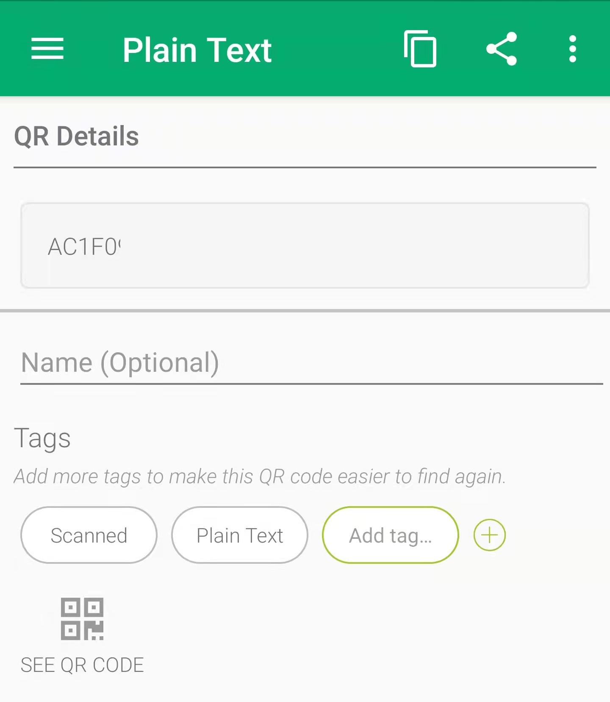
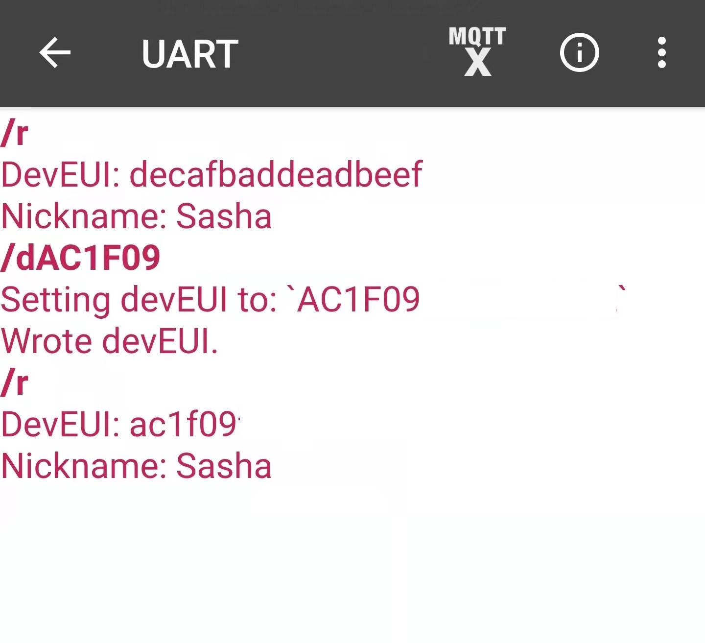
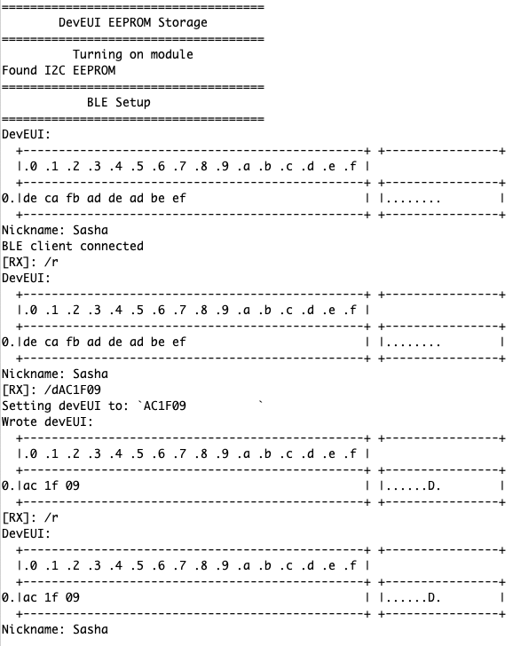
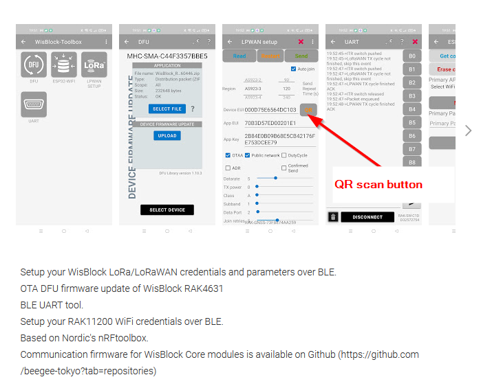

# RAK4631_DevEUI_Programmer

This is a small sketch that lets you burn in your WisBlock RAK4631 with its DevEUI – which can serve as UUID even if you are not using LoRaWAN. Because the nRF52840 doesn't have an EEPROM or similar, there's no way to store data permanently. So by using the [RAK15000 EEPROM Module](https://store.rakwireless.com/collections/wisblock-storage/products/wisblock-eeprom-module-rak15000), which features an AT42CM02 with 256 KB of EEPROM, you can save that – and much more – to your RAK4631 project.

To make things as user-friendly as possible, I gave the sketch two serial inputs: the Serial Monitor, and the BLE interface. The commands are identical: whenever there's input on one of them, it will be treated by the same routine. The commands are:

* `/d` followed by 16 hexadecimal digits: Set DevEUI.
* `/n` followed by a string: Set the device's Nickname.
* `/r`: Read the DevEUI and the nickname if available.

The sketch comes with a `Helper.h` file that you can basically reuse in your own projects to read the data, and possibly write to the EEPROM. The functions are:

* `void hexDump(char *buf, uint16_t len);`
  Pretty-print a buffer.
* `void readEEPROM(char *buf, uint8_t len, uint16_t addr);`
  Read `len` bytes from the EEPRON into `buf`, starting at `addr`.
* `void setDevEUI(char *src, char *dest);`
  Sets the DevEUI, a 16-char hexadecimal string, to an 8-byte buffer.
* `void readInfo(char *eui, char *buf);`
  Reads the DevEUI and Nickname, and displays them.
* `uint16_t readEEPROMString(char *buf, uint16_t addr);`
  Reads a zero-terminated string to `buf`.
* `void setNickname(char *buf);`
  Sets the nickname.

The import part here is that by allowing BLE input, you can manage the burning of the DevEUI quite smoothly on your phone. Scan the QR Code that's on the module:

Copy-paste it into Bluefruit Connect, or any other BLE UART app, prefixed with `/d`.

Here's what it looks like from the Serial Monitor:

### Note

This functionality, and many more, has been in the [Wisblock Toolbox](https://play.google.com/store/apps/details?id=tk.giesecke.wisblock_toolbox) Android app by Bernd, our WisBlock product manager. This little sketch is more a tutorial on how to use the EEPROM.

